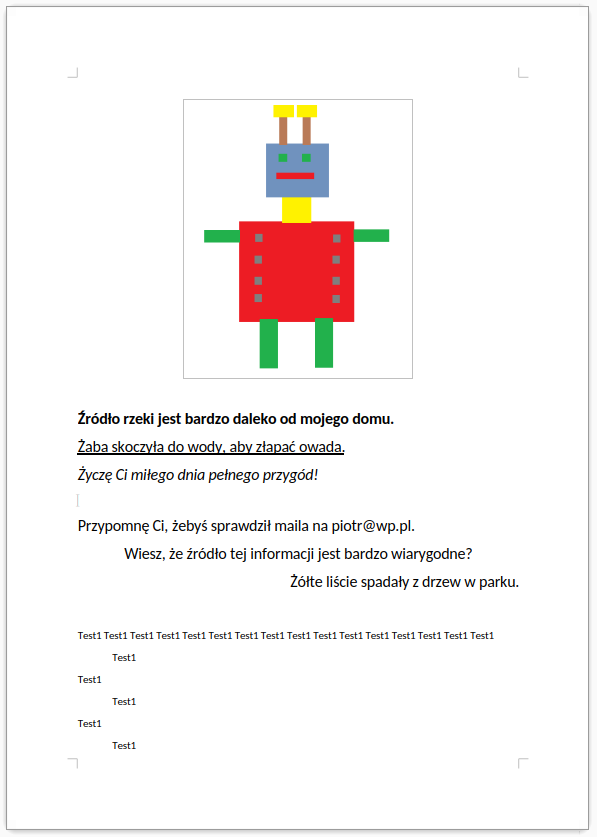

# Instrukcja

## 1. Tworzenie katalogu i zapisywanie plików

1. Utwórz katalog i nadaj mu nazwę w formacie: ```[klasa]_[imię]_[nazwisko]``` (bez znaków specjalnych, zapisane małymi literami).
   - **Przykład:** ```4a_jan_kowalski```

2. Jeśli masz podłączony pendrive, zapisz folder na nim. Jeśli nie, umieść go w katalogu domowym użytkownika.

3. W utworzonym katalogu stwórz nowy folder o nazwie **imgs**.

4. Otwórz program **Paint** i wykonaj rysunek przedstawiony w poniższym dokumencie.

5. Zapisz obrazek pod nazwą **ludek.png** w katalogu **imgs**.
   - **Uwaga:** Postaraj się użyć tych samych kolorów co w przykładzie.

---

## 2. Tworzenie dokumentu w Wordzie

1. Otwórz program **Word** i utwórz nowy dokument.

2. Zapisz plik w katalogu ```[klasa]_[imię]_[nazwisko]``` pod nazwą:  
   **zdania_i_ludek.docx**

3. Wklej do dokumentu wcześniej utworzony obrazek **ludek.png**.

4. Przepisz poniższy tekst z przykładu, zachowując odpowiednie formatowanie:

   - Wiersze **1–8** – czcionka **16 pt**  
   - Pozostałe wiersze – czcionka **11 pt**

### Formatowanie poszczególnych wierszy:

- **Wiersz 1:** pogrubiony
- **Wiersz 2:** podkreślony
- **Wiersz 3:** pochylony (kursywa)
- **Wiersz 4:** pusta linia (Enter)
- **Wiersz 5:** wyrównany do lewej
- **Wiersz 6:** wyrównany do środka
- **Wiersz 7:** wyrównany do prawej
- **Wiersz 8:** pusta linia (Enter)

Dodatkowo:
- W **wierszach 10, 12 i 14** użyj tabulatora, aby dodać wcięcie.


 
