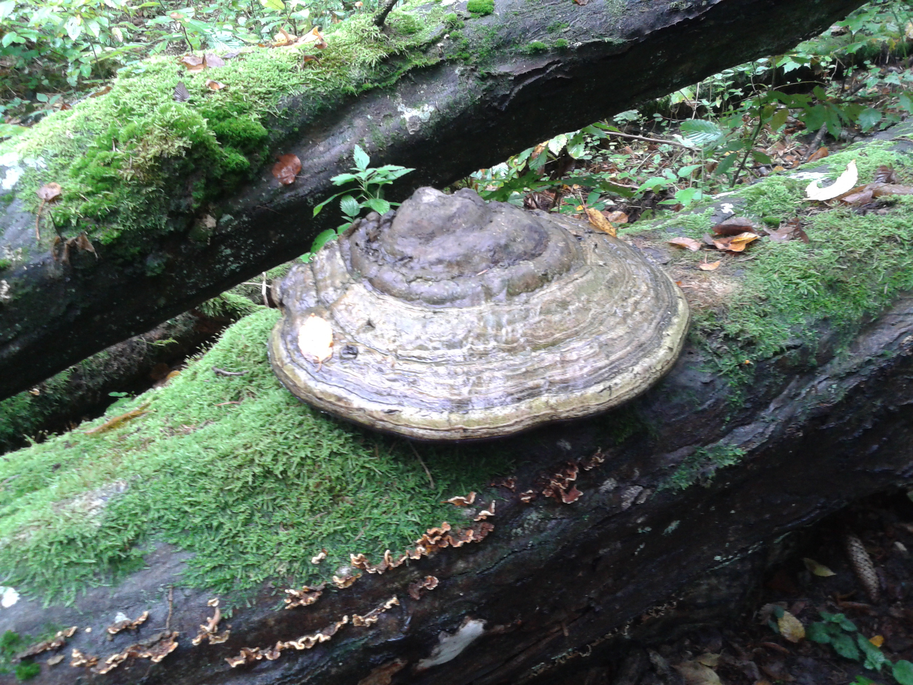
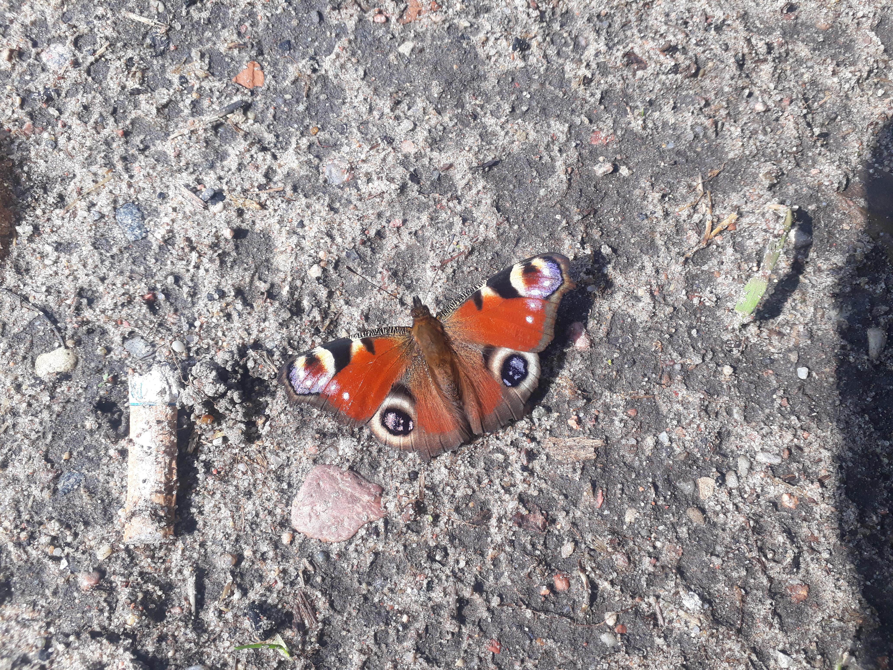
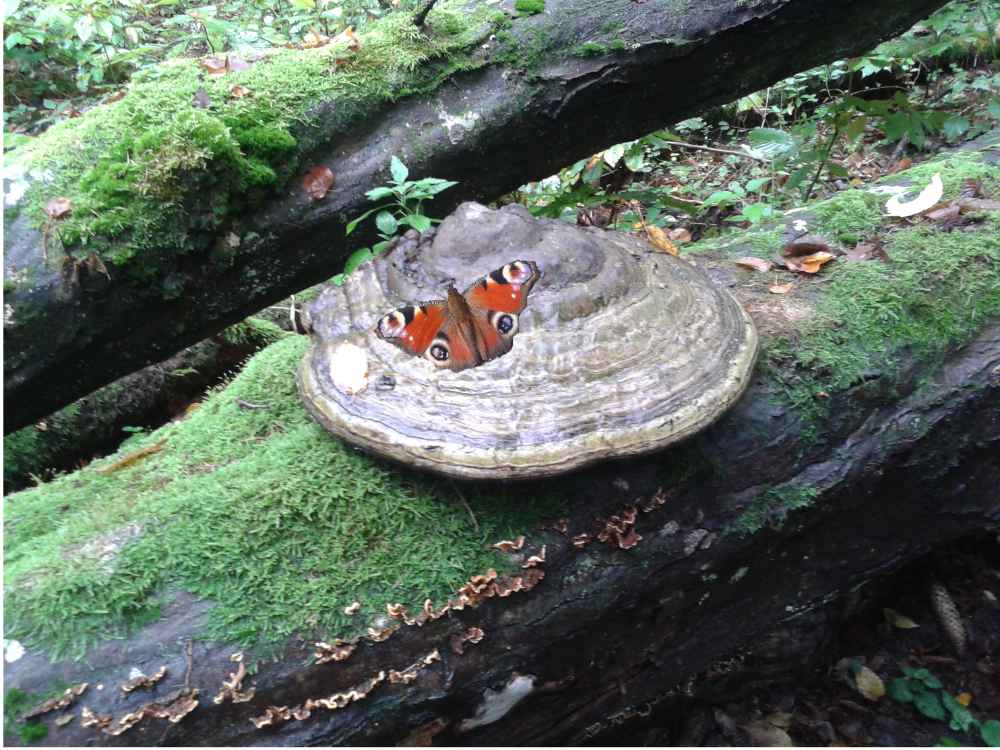

## Zadanie: Fotomontaż w GIMP  

Stwórz fotomontaż w GIMP-ie, łącząc dwa lub więcej zdjęć. Poniżej umieść obrazy, z których korzystasz, oraz wynikowy fotomontaż.  

### Użyte obrazy:
  
  

### Wynikowy fotomontaż:
  

## Użyj poniższego kodu HTML, aby wyświetlić zdjęcia w przeglądarce (zmień nazwy plików w znacznikach ):


```
<!DOCTYPE html>
<html lang="pl">
<head>
    <meta charset="UTF-8">
    <meta name="viewport" content="width=device-width, initial-scale=1.0">
    <title>Fotomontaż w GIMP</title>
</head>
<body>
    <h2>Użyte obrazy:</h2>
    
    
    
    <h2>Wynikowy fotomontaż:</h2>
    
</body>
</html>
```

