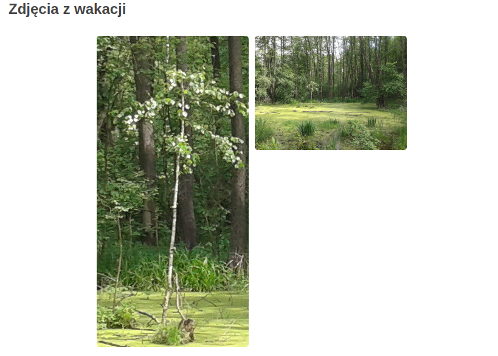

# Zadanie: Strona internetowa o sobie

Twoim zadaniem jest stworzenie estetycznej i intuicyjnej strony internetowej, która przedstawi Ciebie, Twoje usługi lub wybrany produkt. Tworząc treść, zastosuj zasadę 5W (Who?, What?, Where?, When?, Why?), aby jasno określić, kim jesteś, co oferujesz i dlaczego warto skorzystać z Twojej oferty. Wykorzystaj również elementy graficzne i identyfikację wizualną, aby lepiej zobrazować działalność swojej firmy. Możesz posłużyć się fikcyjnymi danymi oraz tekstem zastępczym "Lorem Ipsum". Jeśli używasz obrazów z innych źródeł, pamiętaj o dodaniu informacji o ich pochodzeniu oraz licencji.

### Wymagania HTML

Strona powinna zawierać odpowiednie elementy HTML, które są niezbędne do poprawnego wyświetlania i indeksowania przez wyszukiwarki internetowe (SEO).

- W tagu ```<head>``` należy dodać: 
  - Tytuł strony. 
  - Kodowanie UTF-8. 
  - Autora 
  - Słowa kluczowe
  - Opis strony (ale zaleca się, aby długość opisu wynosiła do 160 znaków). 
- W tagu ```<body>``` należy dodać:
  - Tytuł strony (nagłówek h1), np. "John Doe - usługi informatyczne". Ważne jest, aby w tym znaczniku określić najważniejszą informację na temat zawartości strony.
  - Krótka biografia - podstawowe informacje o sobie: imię, zainteresowania, hobby, plany zawodowe oraz krótki opis usług.
  - Sekcja ```Moje hobby``` (nagłówek h2) - lista przedstawiająca Twoje zainteresowania.
  - Sekcja ```Usługi``` (nagłówek h2) - przedstawienie oferowanych usług w formie tabeli (lub, opcjonalnie, w układzie flexbox jako zadanie dodatkowe).
  - Sekcja ```Kontaktowa``` (nagłówek h2), np. adres e-mail, link do profilu na LinkedIn.
  - Obrazek - Twoje zdjęcie lub avatar.
  - Umieść minimum 4 zdjęcia z wakacji - dwa obok siebie na dużym ekranie, a na mniejszych ekranach jedno pod drugim. Preferowane jest, abyś użył swoich zdjęć. Jeśli ich nie masz, możesz skorzystać z moich, które znajdziesz w katalogu ```./imgs/holiday/```.
  - Dodaj logo (opcjonalnie).

### Wymagania CSS - Stylizacja strony

- Zadbaj o estetyczny wygląd strony, wykorzystując kolory, czcionki, marginesy i paddingi.
- Użyj podstawowych właściwości CSS, m.in.:
  - Stylizacja tła, tekstu i nagłówków.
  - Wyśrodkowanie elementów.
  - Formatowanie list, tabel, div-ów i paragrafów.

### Responsywność strony

- Strona powinna dobrze wyglądać zarówno na komputerach, jak i urządzeniach mobilnych.
- Użyj ```media queries```, aby dostosować wygląd do różnych rozdzielczości.
- Sprawdź responsywność, zmieniając szerokość okna przeglądarki (sprawdz dla minimalnej szerokości strony: 320 px).

### Zapis pliku

- Utwórz katalog o nazwie ```imie_nazwisko```, zastępując znaki diakrytyczne ich odpowiednikami (np. „robert_szczepanski”) i używając wyłącznie małych liter. W katalogu umieść plik ```imie-nazwisko.html```, również zapisując go małymi literami i zamieniając znaki diakrytyczne (np. „robert-szczepanski.html”). W tym pliku dodaj znaczniki HTML, a style CSS umieść w sekcji <style>. Przykład można znaleźć w pliku: [john-doe.html](https://github.com/cmsrs/school/blob/main/html_and_css/john_doe/john-doe.html).
- W tym katalogu utwórz folder imgs, w którym umieścisz zdjęcia potrzebne na stronę.
- Zapisz plik na pendrive lub przechowaj w chmurze (np. Google Drive), aby móc go wykorzystać w kolejnym zadaniu.

Dobrze zaplanowane adresy URL mają kluczowe znaczenie dla wyszukiwarek internetowych i wpływają na pozycjonowanie strony.

# Zdanie: Sztuka publikowania w sieci

Publikowanie treści w internecie wymaga nie tylko dbałości o estetykę i funkcjonalność strony, ale także przestrzegania zasad prawnych i stosowania skutecznych metod angażowania użytkowników. Wybierz jedno z poniższych zadań do wykonania. Możesz skorzystać z fikcyjnych danych oraz tekstu zastępczego, takiego jak "Lorem Ipsum".

- Umieść odwołanie do polityki prywatności w widocznym miejscu na stronie. Możesz wyróżnić je np. poprzez umieszczenie linku na czerwonym tle, kierującego do pliku: ```imie_nazwisko/polityka-prywatnosci.html``` oraz utwórz stronę zawierającą regulamin – zapisz ją jako plik: ```imie_nazwisko/regulamin.html```. Następnie dodaj link do tej strony na stronie głównej, aby użytkownicy mogli łatwo do niej dotrzeć.

- Stwórz wersję strony w innym języku, np. angielskim, aby dotrzeć do szerszej grupy odbiorców. Skuteczna komunikacja wymaga nie tylko tłumaczenia treści, ale także dostosowania jej do kultury i oczekiwań użytkowników. Dodaj przełącznik językowy na stronie głównej, umożliwiający użytkownikom zmianę wersji językowej. Link do strony w innym języku powinien mieć format: 
```imie_nazwisko/imie-nazwisko-lang.html```, np.: ```john-doe.html/john-doe-en.html```.

przykład:

Na stronie john-doe.html dodajemy:

```
<div class="language-switcher">
  <a href="john-doe.html" class="lang-link pl active">Polski</a> | 
  <a href="john-doe-en.html" class="lang-link en">English</a>
</div>
```

Na stronie john-doe-en.html:

```
<div class="language-switcher">
  <a href="john-doe.html" class="lang-link pl">Polski</a> | 
  <a href="john-doe-en.html" class="lang-link en active">English</a>
</div>
```

Na obu stronach dodajemy następujace style:

```
.language-switcher {
    text-align: right;
    margin: 10px;
    font-size: 14px;
}

.lang-link {
    text-decoration: none;
    padding: 5px 10px;
    border-radius: 5px;
}

.lang-link.pl {
    background-color: #f0f0f0;
    color: #333;
}

.lang-link.en {
    background-color: #f0f0f0;
    color: #333;
}

/* Podkreślenie aktywnego języka */
.lang-link.active {
    font-weight: bold;
    background-color: #007bff;
    color: white;
}
```


- Utwórz prostą stronę internetową, która skutecznie zachęci użytkowników do skorzystania z Twoich usług. Wykorzystaj tzw. lead, czyli chwytliwe i angażujące wezwanie do działania, które ma na celu przyciągnięcie uwagi potencjalnych klientów i skłonienie ich do podjęcia konkretnej akcji – np. zapisania się na newsletter, skontaktowania się z Tobą lub skorzystania z oferty. Przykładowy lead znajdziesz na stronie: [lead.html](https://github.com/cmsrs/school/blob/main/html_and_css/lead/lead.html). Pamiętaj, że skuteczny lead powinien być krótki, treściwy i dobrze dopasowany do grupy docelowej. Może zawierać elementy perswazji, takie jak korzyści wynikające z oferty, ograniczona dostępność usługi („Tylko dziś!"), czy bezpośrednie wezwanie do działania („Zarezerwuj teraz!”). Utwórz lead z trafnym obrazkiem, który będzie nawiązywał do Twojej działalności i przyciągał uwagę użytkowników. Grafika powinna wspierać przekaz, wzbudzać zainteresowanie i zachęcać do skorzystania z oferty. Lead powinien zawierać link do strony docelowej (utworzonej w zadaniu 1), na którą użytkownik zostanie przekierowany.

- Stwórz krótki film związany z Twoją działalnością lub pasją i opublikuj go w internecie, np. na YouTube. Opcjonalnie możesz umieścić link do filmu na swojej stronie. Pamiętaj, że publikowanie treści w sieci to nie tylko forma promocji, ale także sztuka przyciągania uwagi. Aby Twój film był bardziej angażujący: zadbaj o jakość nagrania, stwórz atrakcyjną miniaturę, dodaj ciekawy opis i tytuł.

### dodatkowe zadania

- Zabezpiecz adres e-mail przed spamem za pomocą JavaScript. Dzięki temu boty skanujące stronę nie odczytają bezpośrednio adresu e-mail z kodu HTML. Możesz zastosować prostą technikę ukrycia adresu e-mail w kodzie, np.:

```
document.addEventListener("DOMContentLoaded", function () {
    let user = "kontakt";
    let domain = "example.com";
    let emailElement = document.getElementById("email");
    emailElement.innerHTML = `<a href="mailto:${user}@${domain}">${user}@${domain}</a>`;
});
```

- Napisz prosty skrypt w JavaScript, który doda do Twojej strony efekt wizualny, np. spadające płatki śniegu. Płatki powinny delikatnie opadać z góry strony, tworząc efekt zimowego klimatu. Możesz użyć CSS do stylizacji płatków oraz JavaScript do animacji ich ruchu. Wykorzystaj funkcję setInterval() lub requestAnimationFrame(), aby uzyskać płynny efekt.


# Zadanie: Edycja obrazków w programie graficznym

Aby Twoja strona wyglądała profesjonalnie i wczytywała się szybciej, warto odpowiednio przygotować grafiki - np. zdjęcie profilowe i zdjęcia z wakacji - korzystając z programu graficznego GIMP.

### Wymagania dotyczące obrazków:

- ```Kadrowanie``` – Użyj narzędzia kadrowania (Shift + C). Po zaznaczeniu obszaru kadrowania kliknij dwukrotnie w jego wnętrze lub naciśnij Enter. Po przycięciu obraz powinien mieć szerokość ```od 250 px do 270 px```. Zapisz wynik jako kadr.png.
- ```Skalowanie obrazu``` – Zmień rozmiar obrazu tak, aby jego szerokość wynosiła ```od 250 px do 270 px```, zachowując proporcje (Obraz → Skaluj obraz). Zapisz wynik jako skalowanie.png.

### Wstawianie obrazków na stronę

Po przygotowaniu grafik umieść je na stronie, korzystając z elementu ``````
W zadaniu użyj ten sam plik graficzny.
Przykładowy kod HTML:

```
      
      
```

Efekt końcowy powinien wyglądać następująco:


