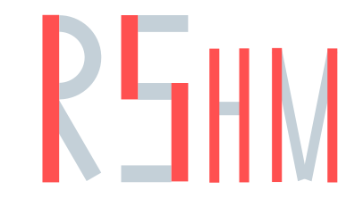

# Zadanie 1 – Projektowanie Logo z Inicjałów

## Opis zadania

Zaprojektuj logo składające się z czterech wielkich liter alfabetu, zgodnie z poniższymi zasadami:

1. Pierwsza litera Twojego imienia
2. Pierwsza litera Twojego nazwiska
3. Litera oznaczająca Twoją klasę (np. "H" w 3H)
4. "M" dla mężczyzny, "F" dla kobiety

Litery powinny być podobne do tych przedstawionych na ilustracji poniżej:


## Wymagania

- Wszystkie litery muszą być pisane wielkimi literami.
- Każda litera powinna składać się z dwóch kolorów, z wyjątkiem liter: C, I, O – te mogą być jednokolorowe.
- Pierwsza i druga litera (inicjały) powinny być większe niż trzecia i czwarta.


## Dla osób, które wcześniej stworzyły stronę WWW

- W tym zadaniu należy użyć dwóch dominujących kolorów ze swojej strony WWW.
- Gotowe inicjały można wykorzystać jako logo na stronie internetowej, używając elementu:


``````

## Przykład:

Dane przykładowej osoby:
- Imię: Robert
- Nazwisko: Szczepański
- Klasa: 3H
- Płeć: mężczyzna

Otrzymane litery: R, S, H, M

Przykładowe logo:


