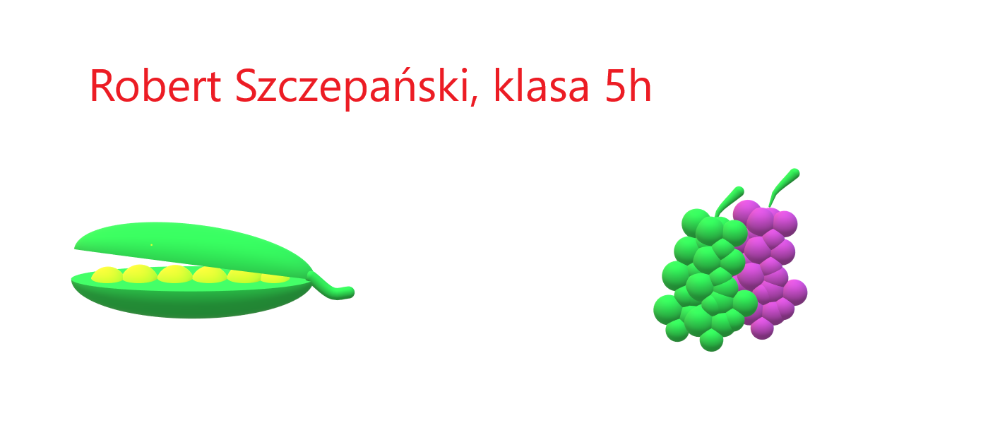

# 🎨 Paint 3D – zadanie: Owoce

Twoim zadaniem jest stworzenie pracy graficznej w programie **Paint 3D**.

---

## 🐠 Cel zadania

Stwórz obraz przedstawiający akwarium **jak najbardziej podobny do przykładu poniżej**.

Zwróć uwagę na:
- rozmieszczenie elementów
- kolory
- szczegóły

---

## 🖼️ Wzór pracy

---

## 📌 Wymagania

Twoja praca powinna zawierać:

- na górze napisz czerwoną czcionką swoje imie i nazwisko oraz klasę
- model 3D strąka zielonego grochu
- model kiści winogron

📢 **Ważne:** Postaraj się, aby praca była **jak najbardziej podobna do wzoru**.

---

## ⭐ Dla chętnych

- dodaj dodatkowe elementy np. więcej rybek, dekoracje
- popraw szczegóły np. cienie, kolory

---

## 💾 Oddanie pracy

- zapisz plik jako **PNG lub JPG**
- nazwij plik: `owoce_imie_nazwisko.png`

## ℹ️ Informacja

Zadanie zostało opracowane na podstawie materiałów dla klasy 5 z podręcznika wydawnictwa **Migra**.