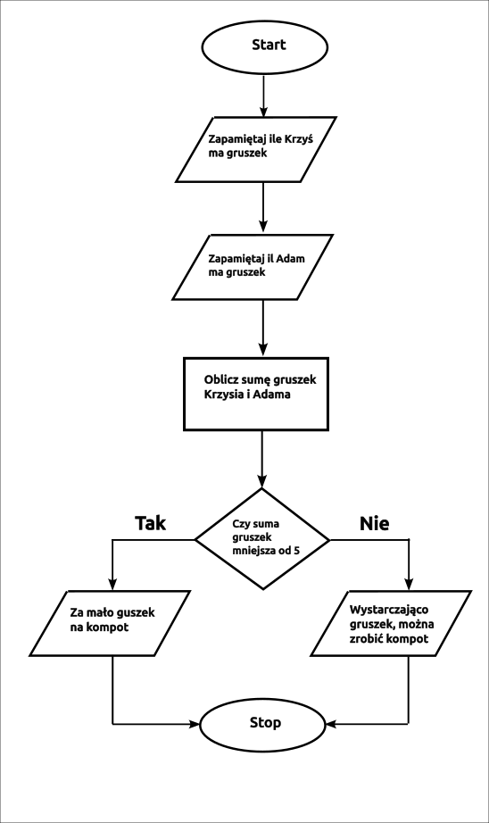
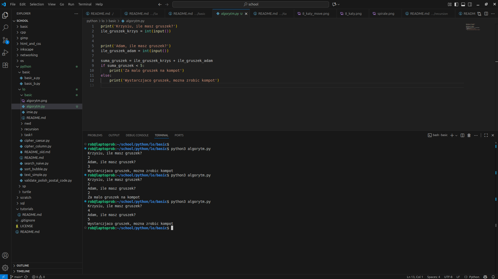
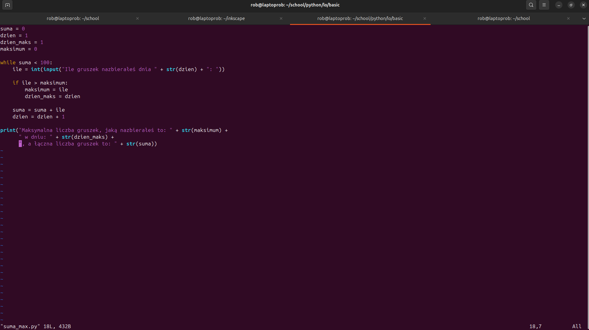
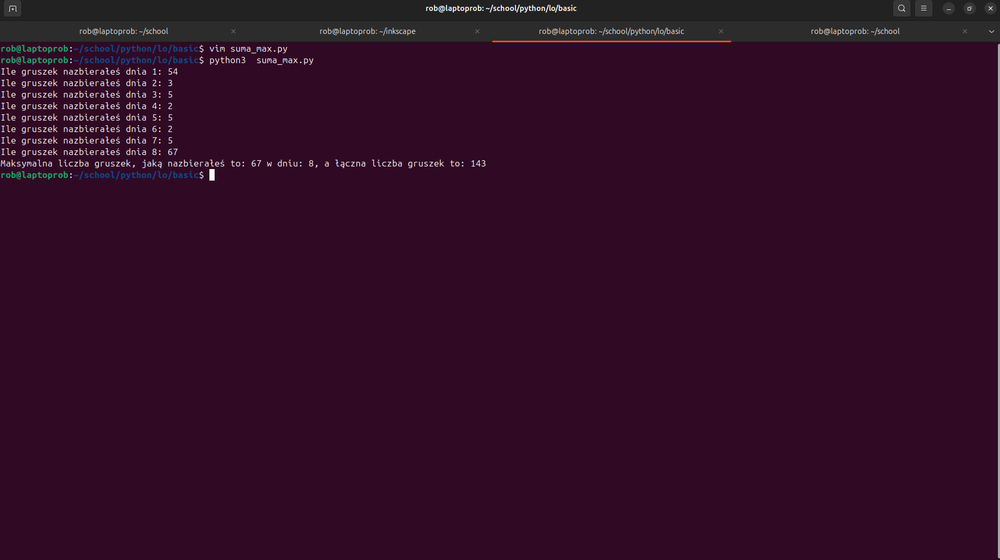

```Algorytm``` – proces lub zestaw kroków służących do wykonania określonego zadania.

Cechy poprawnego algorytmu:

- Skończony – jego wykonanie odbywa się w ograniczonej liczbie kroków.

- Precyzyjny – jednoznacznie określa, jakie czynności należy wykonać, aby osiągnąć zamierzony cel.

- Uniwersalny – może być zastosowany w różnych sytuacjach o podobnym charakterze.

Przykład algorytmu:

1. Zapytaj Krzysia, ile ma gruszek. Zapamiętaj tę liczbę.

2. Zapytaj Adama, ile ma gruszek. Zapamiętaj tę liczbę.

3. Oblicz sumę gruszek Krzysia i Adama. Zapamiętaj wynik.

4. Jeśli suma jest mniejsza niż 5, wypisz informację: „Za mało gruszek na kompot.”
W przeciwnym razie wypisz informację: „Wystarczająco gruszek, można zrobić kompot.”

Graficzne przedstawienie algorytmu:



Oto przykłady popularnych języków interpretowanych:

🔹 Python – bardzo popularny, prosty składniowo, szeroko stosowany w analizie danych, AI, web dev.

🔹 JavaScript – podstawowy język programowania stron internetowych.

🔹 PHP – używany głównie po stronie serwera w aplikacjach webowych.

🔹 Ruby – znany z frameworka Ruby on Rails.

🔹 Perl – dawniej bardzo popularny w administracji systemami i przetwarzaniu tekstu.

🔹 Lua – lekki język do osadzania w grach i aplikacjach.

🔹 R – język do analizy danych i statystyki.

🔹 Shell / Bash – języki skryptowe w systemach Unix/Linux.

🔹 Tcl – używany w automatyzacji i interfejsach graficznych.


Oto najpopularniejsze języki kompilowane:

🔹 C – klasyczny, szybki i wydajny język, używany m.in. w systemach operacyjnych.

🔹 C++ – rozszerzenie C z obiektowością; często używany w grach, systemach i aplikacjach wymagających wydajności.

🔹 Rust – nowoczesny język nastawiony na bezpieczeństwo pamięci i wysoką wydajność.

🔹 Go (Golang) – język stworzony przez Google, prosty i bardzo szybki, często w backendach.

🔹 Swift – kompilowany język Apple, używany w aplikacjach na iOS i macOS.

🔹 Pascal / Object Pascal (Delphi) – dawniej popularny język edukacyjny i aplikacyjny.

🔹 Fortran – używany w naukach ścisłych i obliczeniach numerycznych.

🔹 Ada – stosowany w systemach lotniczych i wojskowych.

🔹 COBOL - jeden z najstarszych języków programowania (powstał w latach 50. XX w.). Zaprojektowany do zastosowań biznesowych – obliczeń finansowych, systemów bankowych, ubezpieczeniowych i administracyjnych.


Dodatkowo istnieją języki hybrydowe, np.

🔹 Java – kompilowana do bytecode’u, który uruchamia JVM (maszyna wirtualna Javy).

🔹 C# – kompilowana do MSIL, wykonywana przez środowisko .NET.



```IDE``` oznacza Integrated Development Environment, czyli po polsku zintegrowane środowisko programistyczne.

To program lub zestaw narzędzi, które pomagają programistom pisać, testować i debugować kod.

📦 Typowe elementy IDE:

🔹 Edytor kodu – z kolorowaniem składni, autouzupełnianiem, podpowiedziami itd.

🔹 Kompilator / interpreter – pozwala uruchamiać program.

🔹 Debugger – umożliwia znajdowanie i naprawianie błędów w kodzie.

🔹 Zarządzanie projektem i plikami – ułatwia organizację kodu.

🔹 Integracja z systemem kontroli wersji (np. Git).

💻 Przykłady popularnych IDE:

🔹 Visual Studio Code (VS Code)

🔹 PyCharm (dla Pythona)

🔹 IntelliJ IDEA (dla Javy i innych języków)

🔹 Eclipse

🔹 Xcode (dla macOS/iOS)

🔹 Android Studio (dla Androida)





