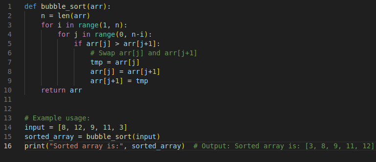

# Sortowanie bąbelkowe (Bubble Sort):

## Jak to działa:

1. Przejdź przez tablicę, jeden element po drugim.

2. Dla każdego elementu porównaj go z następnym elementem.

3. Jeśli bieżący element jest większy niż następny, zamień je miejscami, aby większy element znalazł się dalej.

4. Przejdź przez tablicę tyle razy, ile jest w niej elementów.

## Ręczne przejście przez tablicę – pierwsza iteracja pętli:

- **Krok 1**: Zaczynamy od nieposortowanej tablicy.

    [8, 12, 9, 11, 3]

- **Krok 2**: Patrzymy na dwie pierwsze wartości. Czy mniejsza wartość jest pierwsza? Tak, więc nie musimy ich zamieniać.

    [```8```, ```12```, 9, 11, 3]

- **Krok 3**: Przesuwamy się o jeden krok i patrzymy na wartości 12 i 9. Czy mniejsza wartość jest pierwsza? Nie.

    [8, ```12```, ```9```, 11, 3]

- **Krok 4**: Musimy więc je zamienić miejscami, aby 9 była pierwsza.

    [8, ```9```, ```12```, 11, 3]

- **Krok 5**: Przesuwamy się o jeden krok dalej, patrzymy na 12 i 11.

    [8, 9, ```12```, ```11```, 3]

- **Krok 6**: Musimy je zamienić miejscami, aby 11 znalazła się przed 12.

    [8, 9, ```11```, ```12```, 3]

- **Krok 7**: Patrzymy na 12 i 3 — czy trzeba je zamienić? Tak.

    [8, 9, 11, ```12```, ```3```]

- **Krok 8**: Zamieniamy 12 i 3, aby 3 znalazła się pierwsza.

    [8, 9, 11, ```3```, ```12```]

    W ten sposób ```12``` jest już posortowane, wiec w kolejnych interacjach nie musimy sprawdzać tej wartości

## Ręczne przejście przez tablicę – druga iteracja pętli:    

- **Krok 1**: sprawdzmy 8 i 9. 8 jest mniejsze od 9, wiec nie musimy zamianieć miejscami:

    [```8```, ```9```, 11, 3, 12]

- **Krok 2**: sprawdzmy 9 i 11. 9 jest mniejsze od 11, wiec nie musimy zamianieć miejscami:

    [8, ```9```, ```11```, 3, 12]

- **Krok 3**: sprawdzmy 11 i 3. 11 jest większe od 3, wiec liczby musimy zamianieć miejscami:

    [8, 9, ```11```, ```3```, 12]

- **Krok 4**: Zamianiamy miejscami  11 z 3:

    [8, 9, ```3```, ```11```, 12]

    Nie musimy sprawdzać ostatniej wartości tj. 12 bo w pirwszej interacji pętli wartość ta została umieszczona na właćiwej pozycji

## ...Wykonujemy kolejne interacje pętli, aż do uzyskania posortowanej tablicy.



Rys. 1. Implementacja algorytmu sortowania bąbelkowego w python


Rys. 2. Ilustracja zamiany wartości dwóch zmiennych
