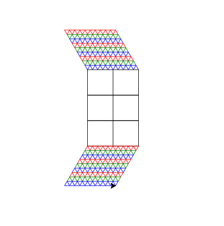

## Zadanie

Narysuj kształt przestawiany ponizej w python turtle
ustal 2 zmienne:
- bok trojkata ronobocznego
- wysokosc prostokata

Trójkatów w jednym wiersz ma być 10,
natomiast wierszy ma być 9, kolory maja sie powtarzxac co trzeci wiersz ma nastepujacy kolor:
-czerwony, zielony niebiski.

w prostokacie umiesc minimalna ilosc kwadratow

dla:
- bok trojkata ronobocznego = 10
- wysokosc prostokata = 150
Otrzymamy nastepująca figure

