# Rekurencja

## Ciąg rekurencyjny

Specyfikacja:
```text
rec_seq(n) = {
    1                dla n = 1
    3 * rec_seq(n-1) dla n > 1
}
```

Kod:
```python
def rec_seq(n):
    #print(f"rec_seq({n}) called")
    if n == 1:
        return 1
    return 3 * rec_seq(n-1)

rec_seq_return = rec_seq(3)
print("out=", rec_seq_return)
```

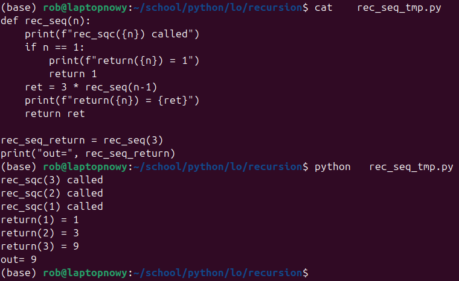
rys. Uruchomienie programu

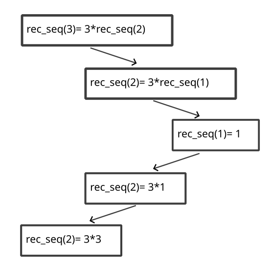
rys. Wywołania rekurencyjne dla funkcji  ```rec_seq``` dla ```n = 3```

## Ciąg Fibonacciego

Specyfikacja:
```text
fib(n) = {
    0               dla n = 0
    1               dla n = 1
    fib(n-1) + fib(n-2)  dla n > 1
}
```

Ciąg Fibonacciego dla danych wejsciowych od 0 do 9
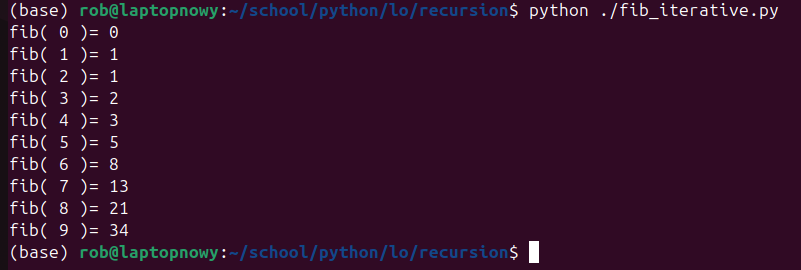

Program ```Fibonacci``` rekurencyjnie:
```python
def fib(n):
    #print(f"fib({n}) called")
    if n <= 1:
        return n
    else:
        return fib(n - 1) + fib(n - 2)


fib_result = fib(4)
print("out=", fib_result)
```

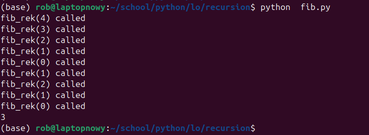
rys. Uruchomienie programu


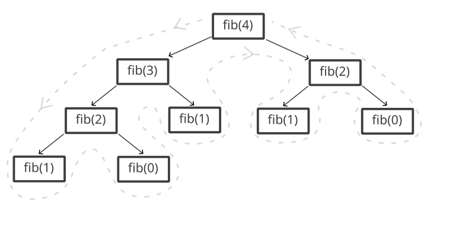
rys. Schemat wywołań rekurencyjnych funkcji ```fib``` dla ```n = 4```


Program ```Fibonacci``` interacyjnie:

```python
def fib_iterative(n):
    a = 1
    b = 0
    for _ in range(n):
        tmp = a + b
        b = a
        a = tmp
    return b

print ( 'fib(4)=', fib_iterative(4))
```

Przykładowe czasy wykonania funkcji Fibonacciego w wersji iteracyjnej i rekurencyjnej dla wartości n od 30 do 44

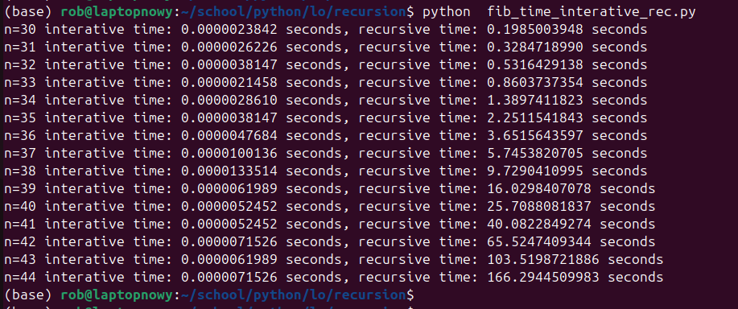

## Złota proporcja a ciąg Fibonacciego

Złota proporcja (ang. *golden ratio*) to liczba oznaczana grecką literą φ (phi), równa w przybliżeniu **1.6180339887...**. Spełnia równanie:

```
x / y = (x + y) / x
```

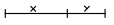

czyli stosunek całości do większej części jest równy stosunkowi większej części do mniejszej.

Można ją również zapisać jako:

```
φ = (1 + √5) / 2
```

Ciekawostka: jeśli policzymy iloraz kolejnych liczb Fibonacciego `F(n) / F(n-1)`, to dla dużych `n` wynik zbliża się do tej liczby:

```
lim (n → ∞) F(n) / F(n-1) = φ
```

Program w tym repozytorium pokazuje, jak złota proporcja pojawia się przy liczeniu liczb Fibonacciego **iteracyjnie**.  
Na obrazku poniżej pokazano iteracje aż do `fib(33)/fib(32)`:

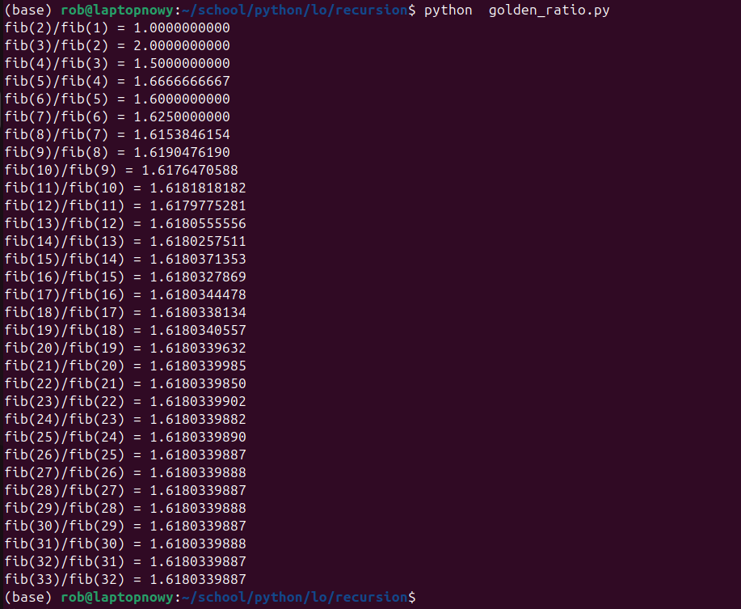


### Złota proporcja pojawia się w:
- naturze (muszle, kwiaty, proporcje ciała),
- architekturze (np. **piramidy** w Egipcie),
- sztuce (obrazy Leonarda da Vinci),
- designie (logo, UI, układy stron).

---


# Zadania

Co masz zrobić (3 etapy):
- Wersja w Scratchu – odtwórz jedną z wybranych figur w Scratchu (z Piórem).
- Python – wersja iteracyjna: zaimplementuj tę samą figurę w Pythonie z użyciem biblioteki Turtle, korzystając z pętli.
- Python – wersja rekurencyjna: zaimplementuj tę figurę ponownie, ale tym razem w sposób rekurencyjny.

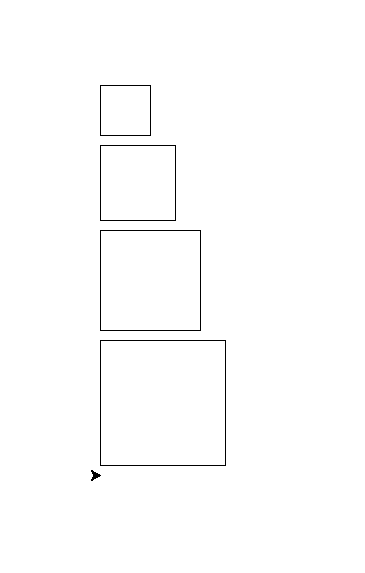
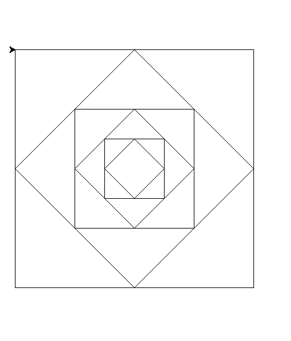
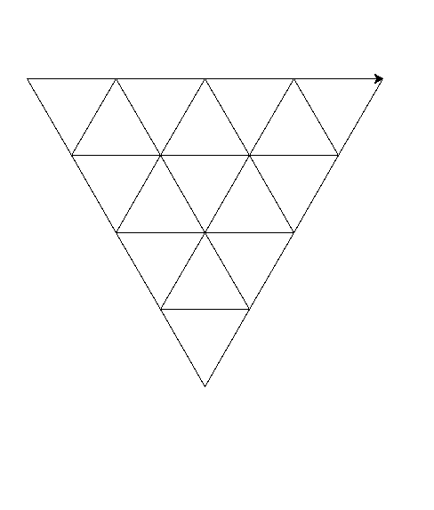


# zadanie na +

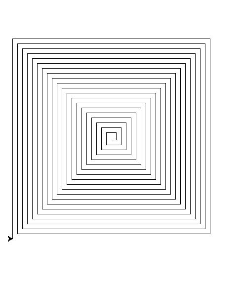