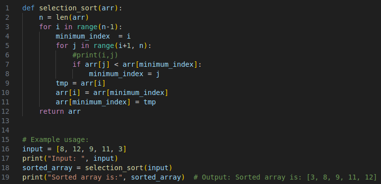
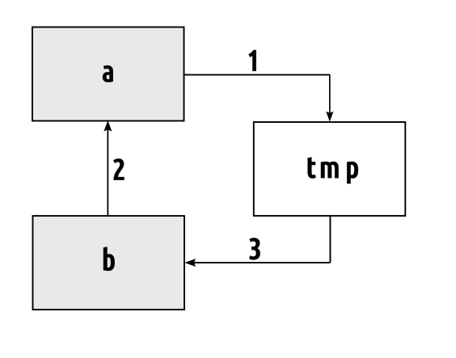

# Sortowanie przez wybieranie (Selection Sort):

## Jak to działa:

1. Przejdź przez tablicę, aby znaleźć najmniejszą wartość.

2. Przenieś najmniejszą wartość na początek nieposortowanej części tablicy.

3. Przechodź przez tablicę ponownie tyle razy, ile jest w niej wartości.


## Ręczne przejście przez tablicę

- **Krok 1**: Zaczynamy od nieposortowanej tablicy.

    [8, 12, 9, 11, 3]

- **Krok 2**: Przechodzimy przez tablicę. Która wartość jest najmniejsza? 3, prawda?

    [8, 12, 9, 11, ```3```]

- **Krok 3**: Zamianiamy wartości 3 i 8

    [ 3, 12, 9, 11, ```8```]

- **Krok 4**: Przeglądamy pozostałe wartości, zaczynając od 12. 8 jest najmniejszą wartością, więc zamieniamy wartości 8 i 12

    [ 3, 8, 9, 11, 12]

- **Krok 5**: Przeglądamy resztę tablicy: 9, 11 i 12. Najmniejsza wartość to 9 wiec nie musimy jej zamianiać.

    [ 3, 8, ```9```, 11, 12]

- **Krok 6**: Przeglądamy resztę tablicy: 11 i 12. Najmniejsza wartość to 11 wiec nie musimy ją zamianiać.

    [ 3, 8, 9, ```11```, 12]

Na koniec tablica jest posortowana.




Rys. 1. Implementacja algorytmu sortowania przez wybieranie w python



Rys. 2. Ilustracja zamiany wartości dwóch zmiennych
