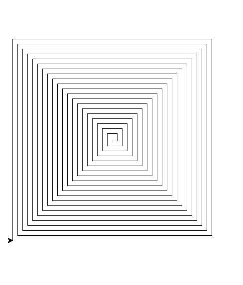

# Zadania

Co masz zrobić (3 etapy):
- Wersja w Scratchu – odtwórz jedną z wybranych figur w Scratchu (z Piórem).
- Python – wersja iteracyjna: zaimplementuj tę samą figurę w Pythonie z użyciem biblioteki Turtle, korzystając z pętli.
- Oblicz sumę obwodów wszystkich najmniejszych trójkątów z wierzchołkiem skierowanym w dół (zad. 1) lub wszystkich kwadratów (zad. 2).
- (dodatkowo - lo3) Python – wersja rekurencyjna: zaimplementuj tę figurę ponownie, ale tym razem w sposób rekurencyjny.

### 1

Zdefiniuj zmienne:

    bok_trójkąta – określającą długość boku,
    ilosc_rzedow – określającą liczbę wierszy.

### 2

Zdefiniuj zmienne:

    bok_kwadratu – określającą długość boku,
    ilosc_kwadratow – określającą liczbę rysowanych kwadratów (przyjmujemy, że musi być parzysta).

# zadanie na +

