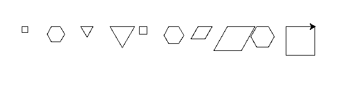
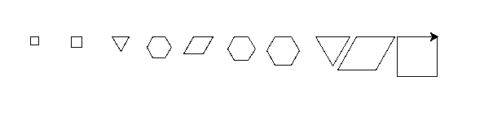
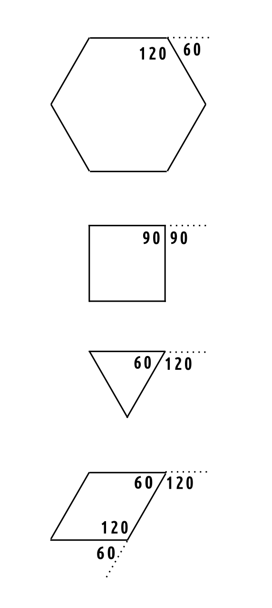

# 🧩 Zadanie: Rysowanie figur

## Opis zadania

Narysuj kolejno (jedna obok drugiej) poniższe figury o podanych długościach boków:

| Figura | Długość boku |
|:--------|:-------------|
| kwadrat | 10 |
| sześciokąt | 15 |
| trójkąt | 21 |
| trójkąt | 42 |
| kwadrat | 13 |
| sześciokąt | 17 |
| romb | 24 |
| romb | 47 |
| sześciokąt | 20 |
| kwadrat | 49 |

---

## 🖥️ Wykonanie

Zadanie możesz wykonać w **Scratchu** (poza zadaniem na 6) lub w **Pythonie** z wykorzystaniem biblioteki `turtle`.

Wzór rysunku pokazano poniżej:

---

## 💯 Kryteria oceny

| Ocena | Opis |
|:------|:------|
| **2** | Figury narysowane z błędami lub nie wszystkie, bez użycia pętli i funkcji |
| **3** | Wszystkie figury narysowane, ale bez użycia pętli i funkcji |
| **3+** | Wszystkie figury narysowane, z użyciem pętli ale bez funkcji |
| **4** | Wszystkie figury narysowane z użyciem pętli i funkcji |
| **5** | Wszystkie figury narysowane z użyciem pętli, funkcji **i listy** |
| **6** | Figury posortowane **od najmniejszego do największego obwodu**, a następnie narysowane. Zadanie **należy wykonać w Pythonie**. Do sortowania użyj jednego z algorytmów:  <ul><li>metoda bąbelkowa *(bubble sort)* </li><li>metoda przez wstawianie *(insertion sort)* </li><li>metoda przez wybieranie *(selection sort)* </li></ul>|
---

## Figury posortowane według obwodów:

## Kąty w figurach:

