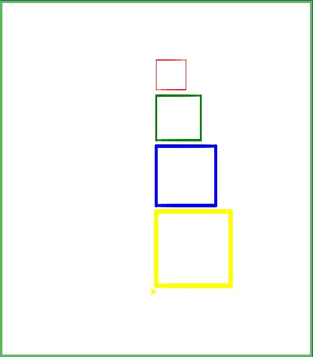
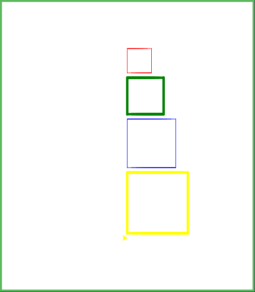

# Zadania

Przed rozpoczęciem pracy nad zadaniami zapoznaj się z przykładami dostępnymi pod adresem:
https://github.com/cmsrs/school/tree/main/python/turtle

Następnie wykonaj poniższe zadania na platformie:
https://pythonsandbox.com/turtle

# Zadanie 1

Narysuj cztery kwadraty, ułożone jeden pod drugim, spełniające następujące warunki:

- Długość boku kwadratu: odpowiednio 50, 75, 100, 125.
- Grubość linii: odpowiednio 1, 3, 5, 7.
- Kolor linii: kolejno czerwony, zielony, niebieski, żółty.
- Odległość między kwadratami wynosi od 1 do 10 jednostek.

Podczas rozwiązania zadania wykorzystaj: pętle for, funkcje, instrukcję warunkową if lub listy (opcjonalne).

# Zadanie 2

Zmodyfikuj pierwsze zadanie tak, aby:

- Kwadraty o numerach 1 i 3 (licząc od góry) miały grubość linii 1.
- Pozostałe kwadraty miały grubość linii 5.

W rozwiązaniu zastosuj instrukcję warunkową if.

# Zadanie 3

Zmodyfikuj pierwsze zadanie tak, aby:

- Jeśli kwadrat ma zielony kolor linii, jego bok miał długość 20.
- W przeciwnym razie długość boku wynosi 100.

W rozwiązaniu zastosuj instrukcję warunkową if.

# Zadanie 4 (dodatkowe)

Zmodyfikuj pierwsze zadanie tak, aby otrzymać wynik przedstawiony poniżej:

