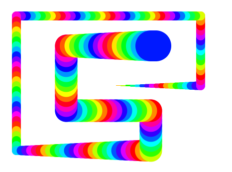
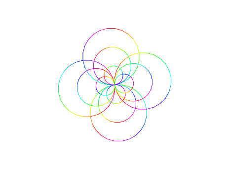

 # Zadanie

## Opis
Stwórz w Scratchu rysunek przedstawiony na obrazku:  

## Instrukcje

- Wykonaj rysunek, **poruszając się duszkiem**.
- Przy **każdej zmianie kierunku** zmieniaj **kolor pisaka o 10**.
- **Rozmiar pisaka** zmieiń o 1 **tylko wtedy**, gdy duszek porusza się w **prawo**.

## Po wykonaniu zadania

1. Zapisz projekt pod dowolną nazwą.
2. Wyloguj się z konta Scratch.
3. Zaloguj się ponownie.
4. Pokaż gotowy projekt do oceny.

> **Uwaga:** Do wykonania zadania wymagane jest posiadanie konta w Scratchu.

## Wymagania

- Konto w Scratchu
- Umiejętność korzystania z pisaka (blok "Pisanie")
- Umiejętność zmiany koloru i rozmiaru pisaka

*Wskazówka:* Przy tworzeniu projektu skorzystaj z przykładu kodu zamieszczonego na stronie 97.

## Dodatkowe

Użyj duszka w Scratchu, aby narysować rysunek przedstawiony poniżej.

