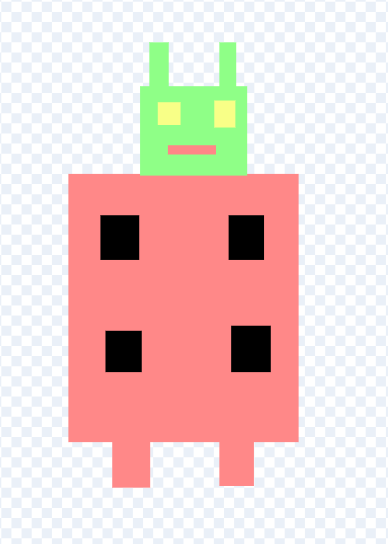
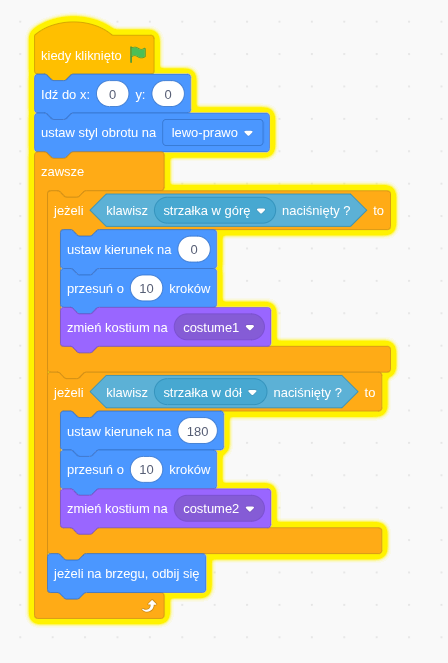

# Zadanie 4

## Opis
Stwórz w Scratchu dwa kostiumy, takie jak na rysunkach poniżej:




Następnie utwórz skrypt pokazany na obrazku:



Kolejnym krokiem jest dodanie ruchu duszka (robota) w prawo i w lewo. Gdy duszek porusza się w prawo — ustaw Kostium 1, a gdy w lewo — ustaw Kostium 2. Należy dodać do powyższego skryptuy warunki, które obsłużą tą funkcjonalność.

Przykładowy pseudokod (blokowy) do użycia w Scratchu:

```text
kiedy kliknięto zieloną flagę
  zawsze
    jeśli klawisz [strzałka w prawo] jest wciśnięty wtedy
      zmień x o 10
      przełącz kostium na "Kostium 1"
    jeśli klawisz [strzałka w lewo] jest wciśnięty wtedy
      zmień x o -10
      przełącz kostium na "Kostium 2"
```

Możesz dostosować wartość przesunięcia (np. 5 zamiast 10).


## Tutorial wideo (YouTube)
Jeśli potrzebujesz pomocy, obejrzyj tutorial wideo — pokazuje krok po kroku tworzenie kostiumów i skryptu.


▶️ **[Poruszanie duszkiem po scenie — zmiana kostiumów](https://youtu.be/RhZQUqATRW0)**

