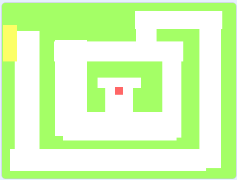
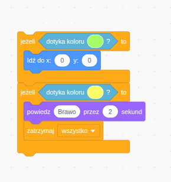
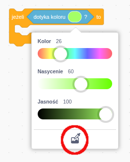

# Zadanie 4

## Opis
Twoim zadaniem jest stworzyć grę, w której duszek np. czerwony kwadrat porusza się po labiryncie a jego celem jest dotknięcie żółtego przedmiotu i wypisanie komunikatu brawo przez 2 sekundy, w przypadku jesli dotknie zilonej sciany gra zaczyna się od początku - tj. duszek ustawia sie w śrokowej częsci. Przykład ustawienia początkowego pokazałem na poniższym rysunku:

kod który odpowida za dotkniecie zielonej sciany oraz zakonczenie gry pokazałem na poniższym rysunku, blok należy umieścić w bloku ``zawsze``.

Pamiętej o poprawnym ustwieniu koloru tła (zielonego) oraz koloru żółtego, na poniżeszym rysunku zaznaczyłem narzędzie, które pozwala pobrać kolor tła..

