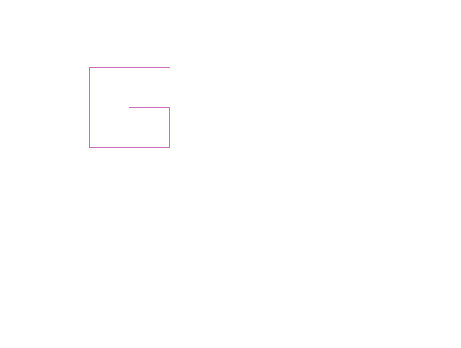

# Zadania

## zadanie 1

Narysuj literę ```G```, zmień jej kolor i przesuń ją do lewej górnej ćwiartki ekranu.



## zadanie 2
 
Narysuj kwadraty o boku ```100 jednostek``` w różnych kolorach, obrócone względem siebie o ```45 stopni```.


