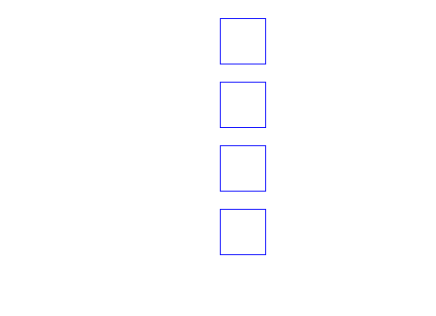

# Zadania

## zadanie A

Narysuj literę ```P```, zmień jej kolor i przesuń ją do lewej górnej ćwiartki ekranu.


## zadanie B

Narysuj kwadrat o boku ```50 jednostek``` w czwartej ćwiartce układu współrzędnych (prawy dolny róg).


## zadanie C
 
Narysuj dwa kwadraty o boku ```100 jednostek``` w różnych kolorach, obrócone względem siebie o ```180 stopni```.


## zadanie C_2

Narysuj ```4 kwadraty``` o boku równym ```50 jednostek```, ustawione jeden pod drugim, oddalone od siebie o ```20 jednostek```, tak jak pokazano na rysunku poniżej.



## zadanie C_3

Narysuj cztery kwadraty, ułożone jeden pod drugim, spełniające następujące warunki:

- Długość boku kwadratu: odpowiednio 10, 35, 60, 85 (różnica 25).
- Odległość między kwadratami wynosi ```10 jednostek```.


## zadanie C_3

Narysuj cztery kwadraty, ułożone jeden pod drugim, spełniające następujące warunki:

- Długość boku kwadratu: odpowiednio 10
- Odległość między kwadratami wynosi: odpowiednio 10, 35, 60 (różnica 25).


## zadanie D
 
Narysuj ```36 kwadratów```, z których każdy jest obrócony o ```10 stopni``` względem poprzedniego. Każdy kwadrat powinien mieć inny kolor. Zobacz rysunek poniżej:


## zadanie E
 
Narysuj siatkę składającą się z 8 rzędów i 8 kolumn kwadratów, tworząc układ 8 × 8. Patrz na poniższy rysunek:


## zadanie F (na 5+)
 
Narysuj siatkę 8 × 8 złożoną z kwadratów. Pokoloruj co drugi rząd na inny kolor. Patrz na poniższy rysunek:


## zadanie G (na 6)
 
Narysuj siatkę 8 × 8 złożoną z kwadratów. Pokoloruj przekątne na inny kolor. Patrz na poniższy rysunek.

