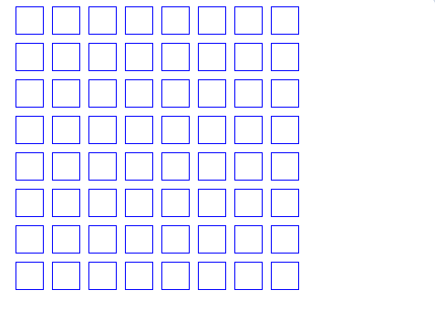

# Zadania

## zadanie 1

Narysuj literę ```P```, zmień jej kolor i przesuń ją do lewej górnej ćwiartki ekranu.


## zadanie 2

Narysuj kwadrat o boku ```50 jednostek``` w czwartej ćwiartce układu współrzędnych (prawy dolny róg).


## zadanie 3
 
Narysuj dwa kwadraty o boku ```100 jednostek``` w różnych kolorach, obrócone względem siebie o ```180 stopni```.


## zadanie 4
 
Narysuj ```36 kwadratów```, z których każdy jest obrócony o ```10 stopni``` względem poprzedniego. Każdy kwadrat powinien mieć inny kolor. Zobacz rysunek poniżej:


## zadanie 5
 
Narysuj siatkę składającą się z 8 rzędów i 8 kolumn kwadratów, tworząc układ 8 × 8. Patrz na poniższy rysunek:



## zadanie 6
 
Narysuj siatkę 8 × 8 złożoną z kwadratów. Pokoloruj co drugi rząd na inny kolor. Patrz na poniższy rysunek:


## zadanie 7
 
Narysuj siatkę 8 × 8 złożoną z kwadratów. Pokoloruj przekątne na inny kolor. Patrz na poniższy rysunek.

