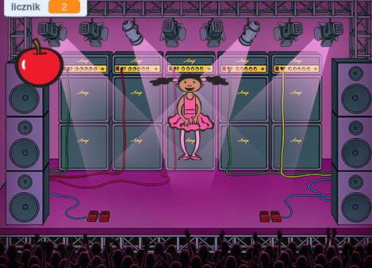

#Zadanie

Stwórz grę składającą się z dwóch duszków: duszek-balerina oraz duszek-jabłko.

Sterowanie duszek-baleriną odbywa się za pomocą klawiszy strzałek.

Celem gry jest złapanie jak największej liczby duszków-jabłek.

Poniżej znajduje się przykładowy zrzut ekranu z gry:

Dodatkowe informacje

Projekt bazuje na materiałach z rozdziału 7, sekcji 5 i 6 książki.