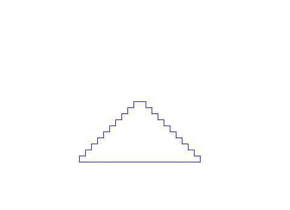
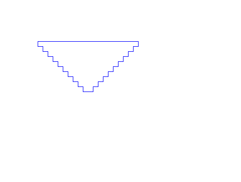
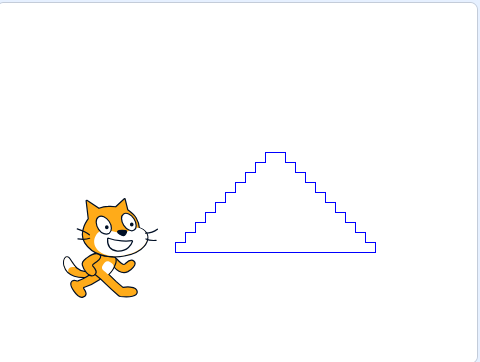
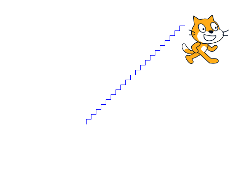
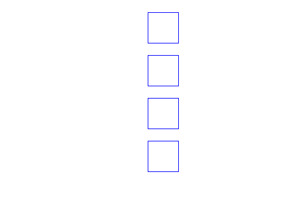
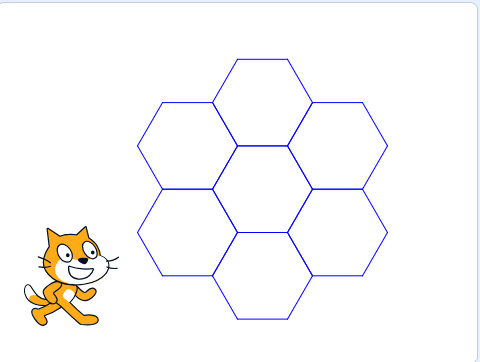
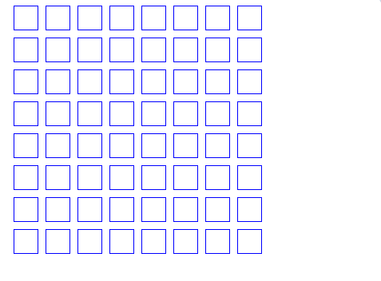
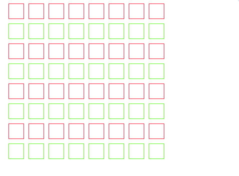

# Zadania

## zadanie 1

Narysuj piramidę pokazaną na poniższym rysunku o boku równym ```10 jednostek```.



## zadanie 2
 
Narysuj odwróconą piramidę pokazaną na poniższym rysunku o boku równym ```10 jednostek```.



## zadanie 3

Narysuj piramidę pokazaną na poniższym rysunku o boku równym ```10 jednostek```.



Jeśli zostanie naciśnięty klawisz ```'a'```, narysuj schody pokazane poniżej.



Skorzystaj z bloku: ```jesli...w przeciwnym razie```, patrz poniższy przykład:


Zrzut ekranu przedstawia projekt dostępny na platformie [Scratch](https://scratch.mit.edu/).  
Zrzut ekranu udostępniony zgodnie z licencją [CC BY-SA 4.0](https://creativecommons.org/licenses/by-sa/4.0/deed.pl).  

## zadanie 4

Narysuj ```4 kwadraty``` o boku równym ```50 jednostek```, ustawione jeden pod drugim, oddalone od siebie o ```20 jednostek```, tak jak pokazano na rysunku poniżej.



## zadanie 5

Narysuj następujące ```sześciokąty``` o boku równym ```50 jednostek```.



## zadanie 6
 
Narysuj siatkę składającą się z 8 rzędów i 8 kolumn kwadratów, tworząc układ 8 × 8. Patrz na poniższy rysunek:



## zadanie 7
 
Narysuj siatkę 8 × 8 złożoną z kwadratów. Pokoloruj co drugi rząd na inny kolor. Patrz na poniższy rysunek:


