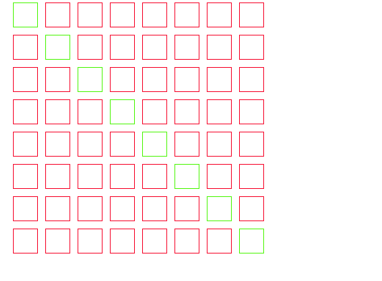

# Zadania

## zadanie 1

Narysuj piramidę pokazaną na poniższym rysunku o boku równym ```10 jednostek```.


## zadanie 2
 
Narysuj odwróconą piramidę pokazaną na poniższym rysunku o boku równym ```10 jednostek```.


## zadanie 3

Narysuj piramidę pokazaną na poniższym rysunku o boku równym ```10 jednostek```.


Jeśli zostanie naciśnięty klawisz ```'a'```, narysuj schody pokazane poniżej.


Skorzystaj z bloku: ```jesli...w przeciwnym razie```, patrz poniższy przykład:


Zrzut ekranu przedstawia projekt dostępny na platformie [Scratch](https://scratch.mit.edu/).  
Zrzut ekranu udostępniony zgodnie z licencją [CC BY-SA 4.0](https://creativecommons.org/licenses/by-sa/4.0/deed.pl).  
Scratch is a project of the Scratch Foundation, in collaboration with the Lifelong Kindergarten Group at the MIT Media Lab. It is available for free at https://scratch.mit.edu
patrz: https://mitscratch.freshdesk.com/pl/support/solutions/articles/4000156890-czy-mog%C4%99-u%C5%BCywa%C4%87-zrzut%C3%B3w-ekranu-ze-scratcha-w-ksi%C4%85%C5%BCce-lub-prezentacji-

## zadanie 4

Narysuj ```4 kwadraty``` o boku równym ```50 jednostek```, ustawione jeden pod drugim, oddalone od siebie o ```20 jednostek```, tak jak pokazano na rysunku poniżej.


## zadanie 5

Narysuj następujące ```sześciokąty``` o boku równym ```50 jednostek```.


## zadanie 6
 
Narysuj siatkę składającą się z 8 rzędów i 8 kolumn kwadratów, tworząc układ 8 × 8. Patrz na poniższy rysunek:


## zadanie 7
 
Narysuj siatkę 8 × 8 złożoną z kwadratów. Pokoloruj co drugi rząd na inny kolor. Patrz na poniższy rysunek:


## zadanie 8
 
Narysuj siatkę 8 × 8 złożoną z kwadratów. Pokoloruj przekątną na inny kolor. Patrz na poniższy rysunek.



## zadanie 9
 
Narysuj siatkę 8 × 8 złożoną z kwadratów. Pokoloruj przekątne na inny kolor. Patrz na poniższy rysunek.


## zadanie 10

Narysuj następujące ```trójkąty``` tak jak pokazano poniźej (dodatkowo: co trzeci wiersz w innym kolorze):

