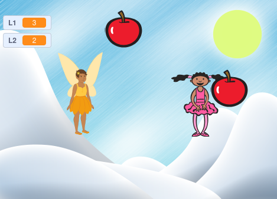

# zadanie

## Opis gry: Łapanie Jabłek

W tej grze każdy z graczy steruje własnym duszkiem-graczem. Celem gry jest łapanie duszków-jabłek.

Gra kończy się, gdy wszystkie jabłka znikną z planszy. Zwycięża gracz, który złapie najwięcej jabłek.

## Instrukcje

- Każdy gracz steruje swoim duszkiem.
- Duszki-gracze łapią duszki-jabłka.
- Gra kończy się, gdy wszystkie jabłka zostaną złapane.
- Wygrywa gracz z największą liczbą złapanych jabłek.

## Przykład

Poniżej znajduje się przykładowy zrzut ekranu gry:

## Dodatkowe informacje

Szczegóły dotyczące realizacji projektu można znaleźć w Rozdziale 9 książki w sekcjach 1 i 2.
