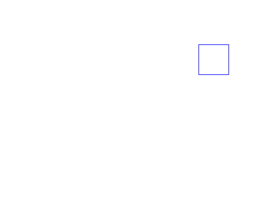
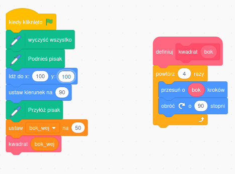
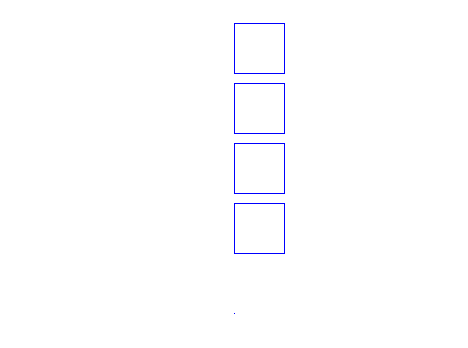
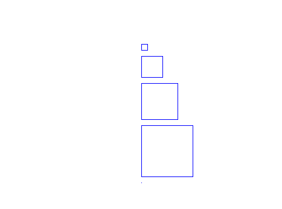
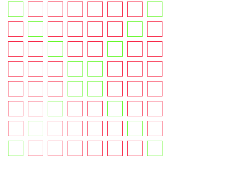

# Zadania

## zadanie 1

Narysuj ```1 kwadrat``` o boku równym ```100 jednostek``` w pierszej ćwiardce układu współrzędnych (prawy dolny róg). Zmodyfikuj podany kod poniżej:





Zrzut ekranu przedstawia projekt dostępny na platformie [Scratch](https://scratch.mit.edu/).  
Zrzut ekranu udostępniony zgodnie z licencją [CC BY-SA 4.0](https://creativecommons.org/licenses/by-sa/4.0/deed.pl).  

## zadanie 2

Narysuj ```4 kwadraty``` o boku równym ```50 jednostek```, ustawione jeden pod drugim, oddalone od siebie o ```10 jednostek```, tak jak pokazano na rysunku poniżej. Wykorzystaj w tym celu funkcje użytą w poprzednim ćwiczeniu.



## zadanie 3

Narysuj cztery kwadraty, ułożone jeden pod drugim, spełniające następujące warunki:

- Długość boku kwadratu: odpowiednio 10, 35, 60, 85.
- Odległość między kwadratami wynosi ```10 jednostek```.



## zadanie 4

Narysuj siatkę 8 × 8 złożoną z kwadratów. Pokoloruj przekątne na inny kolor. Patrz na poniższy rysunek.

