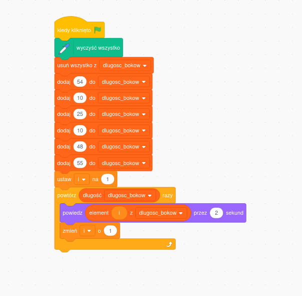

# Zadania

## zadanie A

Narysuj ```1 kwadrat``` o boku równym ```100 jednostek``` w pierszej ćwiardce układu współrzędnych (prawy górny róg). Zmodyfikuj podany kod poniżej:


Zrzut ekranu przedstawia projekt dostępny na platformie [Scratch](https://scratch.mit.edu/).  
Zrzut ekranu udostępniony zgodnie z licencją [CC BY-SA 4.0](https://creativecommons.org/licenses/by-sa/4.0/deed.pl).  
Scratch is a project of the Scratch Foundation, in collaboration with the Lifelong Kindergarten Group at the MIT Media Lab. It is available for free at https://scratch.mit.edu
patrz: https://mitscratch.freshdesk.com/pl/support/solutions/articles/4000156890-czy-mog%C4%99-u%C5%BCywa%C4%87-zrzut%C3%B3w-ekranu-ze-scratcha-w-ksi%C4%85%C5%BCce-lub-prezentacji-

## zadanie B

Narysuj ```4 kwadraty``` o boku równym ```50 jednostek```, ustawione jeden pod drugim, oddalone od siebie o ```10 jednostek```, tak jak pokazano na rysunku poniżej. Wykorzystaj w tym celu funkcje użytą w poprzednim ćwiczeniu.


## zadanie C

Narysuj cztery kwadraty, ułożone jeden pod drugim, spełniające następujące warunki:

- Długość boku kwadratu: odpowiednio 10, 35, 60, 85.
- Odległość między kwadratami wynosi ```10 jednostek```.


Podpowiedź: Każdy kolejny kwadrat ma bok dłuższy o 25 jednostek, a początkowa długość boku wynosi 10 jednostek.

## zadanie D

Narysuj cztery kwadraty, ułożone jeden pod drugim, spełniające następujące warunki:

- Długość boku kwadratu: odpowiednio 10, 35, 60, 85.
- Grubość linii: odpowiednio 1, 3, 5, 7.
- Każdy kwadrat w innym kolorze linii.
- Odległość między kwadratami wynosi od 1 do 10 jednostek.


Podpowiedź: Grubość linii każdego kolejnego kwadratu jest większa o 2 jednostki.

## zadanie E

Zmodyfikuj czwarte zadanie tak, aby:

- Kwadraty o numerach 1 i 3 (licząc od góry) miały grubość linii 1.
- Pozostałe kwadraty miały grubość linii 5.


W rozwiązaniu zastosuj instrukcję warunkową if oraz operację modulo (resztę z dzielenia przez 2).

## zadanie F

Narysuj siatkę 8 × 8 składającą się z kwadratów, zakładając, że odległość między nimi wynosi 10 jednostek. Pokoloruj przekątne na inny kolor, wzorując się na poniższym rysunku. Wykorzystaj funkcję z pierwszego ćwiczenia i utwórz zmienną ```bok_kwadratu```, której modyfikacja zmieni rozmiar wszystkich kwadratów.


## zadanie G



Zrzut ekranu przedstawia projekt dostępny na platformie [Scratch](https://scratch.mit.edu/).  
Zrzut ekranu udostępniony zgodnie z licencją [CC BY-SA 4.0](https://creativecommons.org/licenses/by-sa/4.0/deed.pl).  
Scratch is a project of the Scratch Foundation, in collaboration with the Lifelong Kindergarten Group at the MIT Media Lab. It is available for free at https://scratch.mit.edu
patrz: https://mitscratch.freshdesk.com/pl/support/solutions/articles/4000156890-czy-mog%C4%99-u%C5%BCywa%C4%87-zrzut%C3%B3w-ekranu-ze-scratcha-w-ksi%C4%85%C5%BCce-lub-prezentacji-


Przeanalizuj poniższy kod, w którym zastosowano listę (zwaną także tablicą). Następnie, korzystając z tej listy, narysuj kwadraty o bokach: 54, 10, 25, 10, 48, 55 ustawione jeden pod drugim, oddalone od siebie o ```10 jednostek```, zgodnie z ilustracją poniżej.


Zrzut ekranu przedstawia projekt dostępny na platformie [Scratch](https://scratch.mit.edu/).  
Zrzut ekranu udostępniony zgodnie z licencją [CC BY-SA 4.0](https://creativecommons.org/licenses/by-sa/4.0/deed.pl).  
Scratch is a project of the Scratch Foundation, in collaboration with the Lifelong Kindergarten Group at the MIT Media Lab. It is available for free at https://scratch.mit.edu
patrz: https://mitscratch.freshdesk.com/pl/support/solutions/articles/4000156890-czy-mog%C4%99-u%C5%BCywa%C4%87-zrzut%C3%B3w-ekranu-ze-scratcha-w-ksi%C4%85%C5%BCce-lub-prezentacji-


## zadanie H

Narysuj następujące ```trójkąty``` tak jak pokazano poniźej (co trzeci wiersz w innym kolorze):


