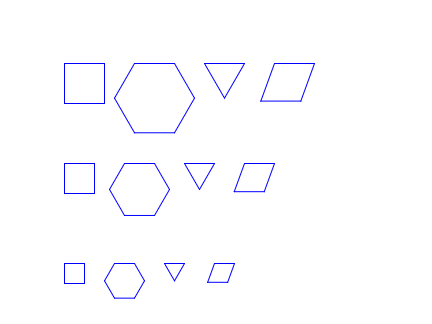

### Zadanie

Narysuj w pierwszym wierszu kwadrat, sześciokąt, trójkąt i romb o boku 40.
W drugim wierszu narysuj te same figury o boku 30,
a w trzecim wierszu — o boku 20.
Rysuj zgodnie ze wzorem pokazanym na obrazku.

## 🧮 System oceniania

| **Ocena** | **Opis** |
|------------|----------|
| **3** | Wszystkie figury narysowane, ale bez użycia funkcji. |
| **4** | Wszystkie figury narysowane z użyciem funkcji, ale bez parametrów. |
| **5** | Wszystkie figury narysowane z użyciem funkcji z parametrem (długość boku). |
| **6** | Program rozszerzony o dodatkowe figury |

## Kąty w figurach:

