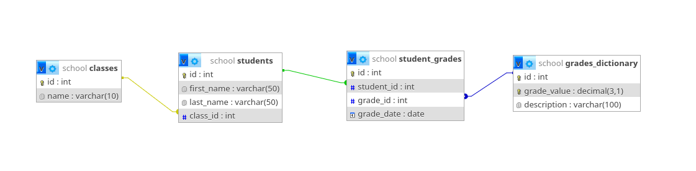

# Ms-Access – zadanie

## 🎯 Cel ćwiczenia
Praktyczne wykorzystanie MS Access do importu danych, tworzenia relacji, kwerend i raportów na podstawie rzeczywistych danych szkolnych.

## 📊 Struktura bazy danych

*Diagram przedstawia relacje między tabelami zawierającymi dane o klasach, uczniach i ocenach.*

## 📋 Zadanie do wykonania

### 1. **Import danych CSV**
Każdy uczeń otrzymuje **unikalny zestaw danych** (numer odpowiada numerowi w dzienniku Librus).

### 📥 Pobierz swój zestaw danych

- Zestaw 01 → [Pobierz zestaw_01.zip](https://raw.githubusercontent.com/cmsrs/school/main/sql/access_dodatkowe/zestawienia/zipy/zestaw_01.zip)
- Zestaw 02 → [Pobierz zestaw_02.zip](https://raw.githubusercontent.com/cmsrs/school/main/sql/access_dodatkowe/zestawienia/zipy/zestaw_02.zip)
- Zestaw 03 → [Pobierz zestaw_03.zip](https://raw.githubusercontent.com/cmsrs/school/main/sql/access_dodatkowe/zestawienia/zipy/zestaw_03.zip)
- Zestaw 04 → [Pobierz zestaw_04.zip](https://raw.githubusercontent.com/cmsrs/school/main/sql/access_dodatkowe/zestawienia/zipy/zestaw_04.zip)
- Zestaw 05 → [Pobierz zestaw_05.zip](https://raw.githubusercontent.com/cmsrs/school/main/sql/access_dodatkowe/zestawienia/zipy/zestaw_05.zip)
- Zestaw 06 → [Pobierz zestaw_06.zip](https://raw.githubusercontent.com/cmsrs/school/main/sql/access_dodatkowe/zestawienia/zipy/zestaw_06.zip)
- Zestaw 07 → [Pobierz zestaw_07.zip](https://raw.githubusercontent.com/cmsrs/school/main/sql/access_dodatkowe/zestawienia/zipy/zestaw_07.zip)
- Zestaw 08 → [Pobierz zestaw_08.zip](https://raw.githubusercontent.com/cmsrs/school/main/sql/access_dodatkowe/zestawienia/zipy/zestaw_08.zip)
- Zestaw 09 → [Pobierz zestaw_09.zip](https://raw.githubusercontent.com/cmsrs/school/main/sql/access_dodatkowe/zestawienia/zipy/zestaw_09.zip)
- Zestaw 10 → [Pobierz zestaw_10.zip](https://raw.githubusercontent.com/cmsrs/school/main/sql/access_dodatkowe/zestawienia/zipy/zestaw_10.zip)
- Zestaw 11 → [Pobierz zestaw_11.zip](https://raw.githubusercontent.com/cmsrs/school/main/sql/access_dodatkowe/zestawienia/zipy/zestaw_11.zip)
- Zestaw 12 → [Pobierz zestaw_12.zip](https://raw.githubusercontent.com/cmsrs/school/main/sql/access_dodatkowe/zestawienia/zipy/zestaw_12.zip)
- Zestaw 13 → [Pobierz zestaw_13.zip](https://raw.githubusercontent.com/cmsrs/school/main/sql/access_dodatkowe/zestawienia/zipy/zestaw_13.zip)
- Zestaw 14 → [Pobierz zestaw_14.zip](https://raw.githubusercontent.com/cmsrs/school/main/sql/access_dodatkowe/zestawienia/zipy/zestaw_14.zip)
- Zestaw 15 → [Pobierz zestaw_15.zip](https://raw.githubusercontent.com/cmsrs/school/main/sql/access_dodatkowe/zestawienia/zipy/zestaw_15.zip)
- Zestaw 16 → [Pobierz zestaw_16.zip](https://raw.githubusercontent.com/cmsrs/school/main/sql/access_dodatkowe/zestawienia/zipy/zestaw_16.zip)
- Zestaw 17 → [Pobierz zestaw_17.zip](https://raw.githubusercontent.com/cmsrs/school/main/sql/access_dodatkowe/zestawienia/zipy/zestaw_17.zip)
- Zestaw 18 → [Pobierz zestaw_18.zip](https://raw.githubusercontent.com/cmsrs/school/main/sql/access_dodatkowe/zestawienia/zipy/zestaw_18.zip)
- Zestaw 19 → [Pobierz zestaw_19.zip](https://raw.githubusercontent.com/cmsrs/school/main/sql/access_dodatkowe/zestawienia/zipy/zestaw_19.zip)
- Zestaw 20 → [Pobierz zestaw_20.zip](https://raw.githubusercontent.com/cmsrs/school/main/sql/access_dodatkowe/zestawienia/zipy/zestaw_20.zip)
- Zestaw 21 → [Pobierz zestaw_21.zip](https://raw.githubusercontent.com/cmsrs/school/main/sql/access_dodatkowe/zestawienia/zipy/zestaw_21.zip)
- Zestaw 22 → [Pobierz zestaw_22.zip](https://raw.githubusercontent.com/cmsrs/school/main/sql/access_dodatkowe/zestawienia/zipy/zestaw_22.zip)
- Zestaw 23 → [Pobierz zestaw_23.zip](https://raw.githubusercontent.com/cmsrs/school/main/sql/access_dodatkowe/zestawienia/zipy/zestaw_23.zip)
- Zestaw 24 → [Pobierz zestaw_24.zip](https://raw.githubusercontent.com/cmsrs/school/main/sql/access_dodatkowe/zestawienia/zipy/zestaw_24.zip)
- Zestaw 25 → [Pobierz zestaw_25.zip](https://raw.githubusercontent.com/cmsrs/school/main/sql/access_dodatkowe/zestawienia/zipy/zestaw_25.zip)
- Zestaw 26 → [Pobierz zestaw_26.zip](https://raw.githubusercontent.com/cmsrs/school/main/sql/access_dodatkowe/zestawienia/zipy/zestaw_26.zip)
- Zestaw 27 → [Pobierz zestaw_27.zip](https://raw.githubusercontent.com/cmsrs/school/main/sql/access_dodatkowe/zestawienia/zipy/zestaw_27.zip)
- Zestaw 28 → [Pobierz zestaw_28.zip](https://raw.githubusercontent.com/cmsrs/school/main/sql/access_dodatkowe/zestawienia/zipy/zestaw_28.zip)
- Zestaw 29 → [Pobierz zestaw_29.zip](https://raw.githubusercontent.com/cmsrs/school/main/sql/access_dodatkowe/zestawienia/zipy/zestaw_29.zip)
- Zestaw 30 → [Pobierz zestaw_30.zip](https://raw.githubusercontent.com/cmsrs/school/main/sql/access_dodatkowe/zestawienia/zipy/zestaw_30.zip)
- Zestaw 31 → [Pobierz zestaw_31.zip](https://raw.githubusercontent.com/cmsrs/school/main/sql/access_dodatkowe/zestawienia/zipy/zestaw_31.zip)
- Zestaw 32 → [Pobierz zestaw_32.zip](https://raw.githubusercontent.com/cmsrs/school/main/sql/access_dodatkowe/zestawienia/zipy/zestaw_32.zip)
- Zestaw 33 → [Pobierz zestaw_33.zip](https://raw.githubusercontent.com/cmsrs/school/main/sql/access_dodatkowe/zestawienia/zipy/zestaw_33.zip)
- Zestaw 34 → [Pobierz zestaw_34.zip](https://raw.githubusercontent.com/cmsrs/school/main/sql/access_dodatkowe/zestawienia/zipy/zestaw_34.zip)
- Zestaw 35 → [Pobierz zestaw_35.zip](https://raw.githubusercontent.com/cmsrs/school/main/sql/access_dodatkowe/zestawienia/zipy/zestaw_35.zip)
- Zestaw 36 → [Pobierz zestaw_36.zip](https://raw.githubusercontent.com/cmsrs/school/main/sql/access_dodatkowe/zestawienia/zipy/zestaw_36.zip)
- Zestaw 37 → [Pobierz zestaw_37.zip](https://raw.githubusercontent.com/cmsrs/school/main/sql/access_dodatkowe/zestawienia/zipy/zestaw_37.zip)
- Zestaw 38 → [Pobierz zestaw_38.zip](https://raw.githubusercontent.com/cmsrs/school/main/sql/access_dodatkowe/zestawienia/zipy/zestaw_38.zip)
- Zestaw 39 → [Pobierz zestaw_39.zip](https://raw.githubusercontent.com/cmsrs/school/main/sql/access_dodatkowe/zestawienia/zipy/zestaw_39.zip)
- Zestaw 40 → [Pobierz zestaw_40.zip](https://raw.githubusercontent.com/cmsrs/school/main/sql/access_dodatkowe/zestawienia/zipy/zestaw_40.zip)
- Zestaw 41 → [Pobierz zestaw_41.zip](https://raw.githubusercontent.com/cmsrs/school/main/sql/access_dodatkowe/zestawienia/zipy/zestaw_41.zip)
- Zestaw 42 → [Pobierz zestaw_42.zip](https://raw.githubusercontent.com/cmsrs/school/main/sql/access_dodatkowe/zestawienia/zipy/zestaw_42.zip)
- Zestaw 43 → [Pobierz zestaw_43.zip](https://raw.githubusercontent.com/cmsrs/school/main/sql/access_dodatkowe/zestawienia/zipy/zestaw_43.zip)
- Zestaw 44 → [Pobierz zestaw_44.zip](https://raw.githubusercontent.com/cmsrs/school/main/sql/access_dodatkowe/zestawienia/zipy/zestaw_44.zip)
- Zestaw 45 → [Pobierz zestaw_45.zip](https://raw.githubusercontent.com/cmsrs/school/main/sql/access_dodatkowe/zestawienia/zipy/zestaw_45.zip)
- Zestaw 46 → [Pobierz zestaw_46.zip](https://raw.githubusercontent.com/cmsrs/school/main/sql/access_dodatkowe/zestawienia/zipy/zestaw_46.zip)
- Zestaw 47 → [Pobierz zestaw_47.zip](https://raw.githubusercontent.com/cmsrs/school/main/sql/access_dodatkowe/zestawienia/zipy/zestaw_47.zip)
- Zestaw 48 → [Pobierz zestaw_48.zip](https://raw.githubusercontent.com/cmsrs/school/main/sql/access_dodatkowe/zestawienia/zipy/zestaw_48.zip)
- Zestaw 49 → [Pobierz zestaw_49.zip](https://raw.githubusercontent.com/cmsrs/school/main/sql/access_dodatkowe/zestawienia/zipy/zestaw_49.zip)
- Zestaw 50 → [Pobierz zestaw_50.zip](https://raw.githubusercontent.com/cmsrs/school/main/sql/access_dodatkowe/zestawienia/zipy/zestaw_50.zip)

**Pliki do zaimportowania** (znajdziesz w folderze po rozpakowaniu swojego zestawu):
- `classes.csv` - dane o klasach
- `students.csv` - dane o uczniach  
- `grades_dictionary.csv` - słownik ocen
- `student_grades.csv` - oceny uczniów

### 2. **Utworzenie relacji między tabelami**
W MS Access:
- Przejdź do zakładki **Narzędzia bazy danych → Relacje**
- Połącz tabele odpowiednimi relacjami zgodnie ze schematem

Narzędzia bazy danych -> Relacje

### 3. **Tworzenie kwerendy**
Utwórz kwerendę SQL, która wyświetli następujące informacje:
- **Klasa** ucznia
- **Imię** i **nazwisko**
- **Średnią ocen** (zaokrągloną do 2 miejsc po przecinku)
- **Sumę wszystkich ocen**
- **Liczbę otrzymanych ocen**

### 4. **Generowanie raportu**
Na podstawie utworzonej kwerendy stwórz **raport** w MS Access, który:
- Będzie czytelnie prezentował dane
- Zostanie posortowany według średniej ocen (malejąco)

### 5. **Eksport do PDF**
Wygeneruj plik **PDF** z utworzonego raportu.

Raporty wynikowe dla każdego zestawienia znajdują się w katalogu
[zestawienia/zestawienia_pdf_znak](zestawienia/zestawienia_pdf_znak).
Twoim zadaniem jest wygenerowanie analogicznych raportów — taka postać stanowi oczekiwany wynik pracy.

---

### Dodatkowe zadanie na ocenę celującą (6)

Rozszerz strukturę bazy danych o przedmioty szkolne:

- Zaproponuj zmiany w strukturze bazy:

    - W jakich tabelach powinny znaleźć się dane o przedmiotach?

    - Jakie nowe relacje należy utworzyć?

- Wprowadź zmiany ręcznie w swojej bazie:

    - Dodaj tabelę subjects (przedmioty)

    - Zmodyfikuj istniejące tabele/relacje

    - Uzupełnij przykładowymi danymi

- Utwórz kwerendę SQL, która wyświetli następujące informacje:
    - **Klasa** ucznia
    - **Imię** i **nazwisko**
    - **Przedmiot**
    - **Ocena**

    Pokaż ucznów tylko z danej klasy.

