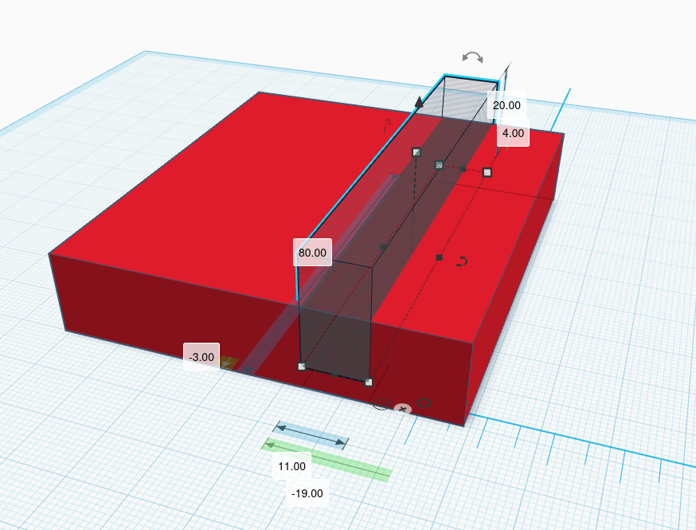
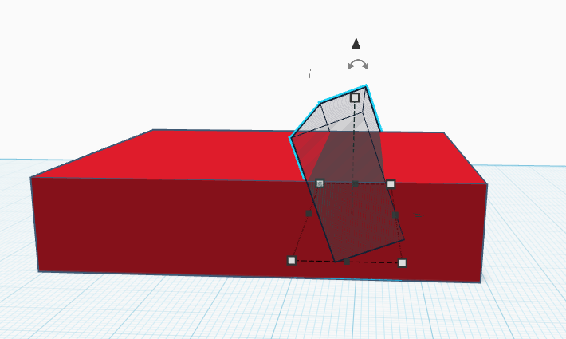
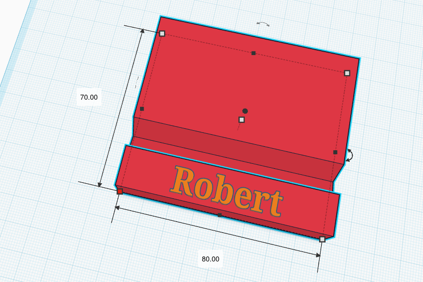

## Zadanie — Utworzenie podstawki pod smartfon w Tinkercad

Aby utworzyć model podstawki, połączymy dwie bryły: prostopadłościan oraz prostopadłościan przezroczysty (otwór).

Wymiary pierwszego prostopadłościanu:

 - długość: 80.00

 - szerokość: 70.00

 - wysokość: 15.00

Wymiary prostopadłościanu przezroczystego (otworu):

 - długość: 80.00

 - szerokość: 11.00

 - wysokość: 20.00

Po ustawieniu elementów uzyskujemy następujący kształt: przezroczysty prostopadłościan jest podniesiony na wysokość 4,00 mm od podłoża i odsunięty od jednej ze ścian o 15,00 mm:

Następnie obracamy prostopadłościan przezroczysty o –20°:

Kolejnym krokiem jest zgrupowanie obu brył, co pozwala uzyskać właściwy kształt podstawki:

Na końcu dodajemy napis. Gotowy projekt wygląda następująco:

Materiał opracowano na podstawie książki dla klasy 7 szkoły podstawowej:

Grażyna Koba, „Informatyka”, temat: „Projektowanie i drukowanie modeli 3D”, wydawnictwo Migra.