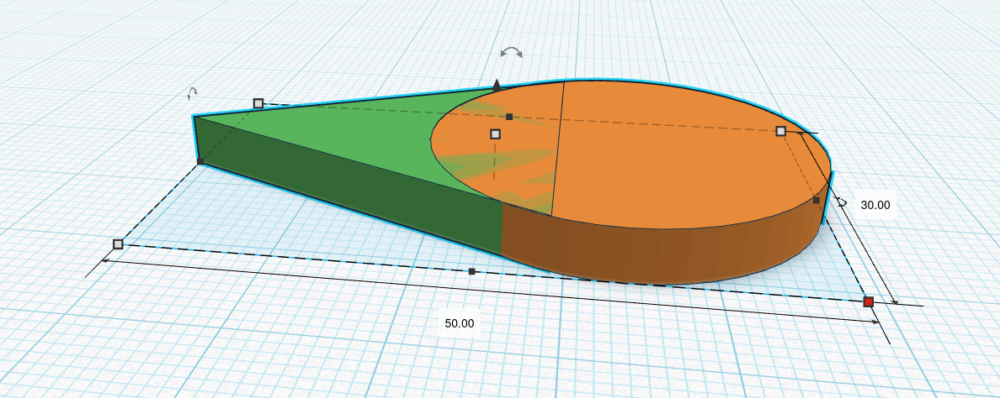
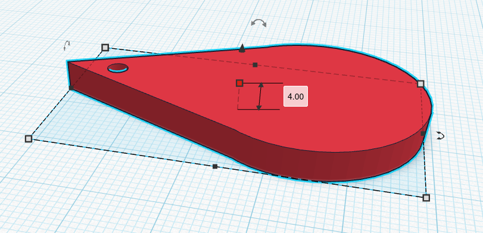
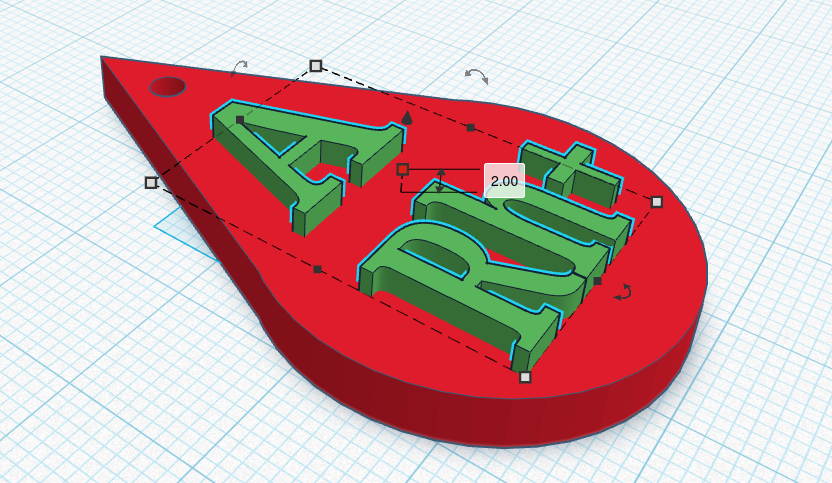

## Zadanie — Utworzenie breloczka w Tinkercad

Aby utworzyć kształt kropli, połączymy dwa bryły: walec oraz dach.

Walec powinien mieć wymiary:

 - długość: 30.00

 - szerokość: 30.00

 - wysokość: 4.00

Dach powinien mieć wymiary:

 - długość: 30.00

 - szerokość: 28.00

 - wysokość: 4.00

Po połączeniu tych elementów otrzymamy następujący kształt:

Następnie tworzymy otwór w kropli, korzystając z przezroczystego walca:

Dodajemy napis z użyciem narzędzia Text o wysokości 2.00. Wpisz swoją grupę krwi — jeśli jej nie znasz, użyj przykładu: „A Rh+”.

Wyrównaj napis oraz otwór do środka kropli. Gotowy breloczek powinien wyglądać tak:

Materiał został opracowany na podstawie książki dla 8. klasy szkoły podstawowej: Informatyka autorstwa Grażyny Koby, temat: „Projektowanie i druk 3D pomocy dydaktycznych”, wydawnictwo Migra.